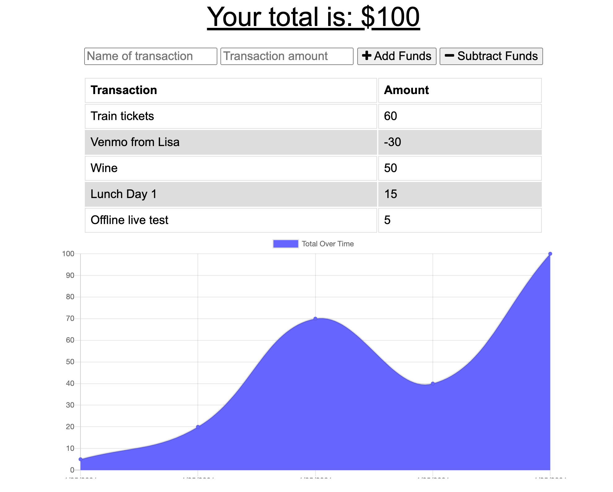

# Progressive Budget

## Description

This application allows the user to track withdrawals and deposits with or without a data/internet connection, making it easier to track overall expenses during travels or similar activity.

## Technologies

The application was built using several Node JS packages (Express, Mongoose, Morgan and Dotenv) and used a NoSQL database (Mongo). The offline functionality was built using service worker and local storage. 

## Pages

https://frozen-woodland-76398.herokuapp.com/

## Contributing

Pull requests are welcome. 

## License

### MIT License

